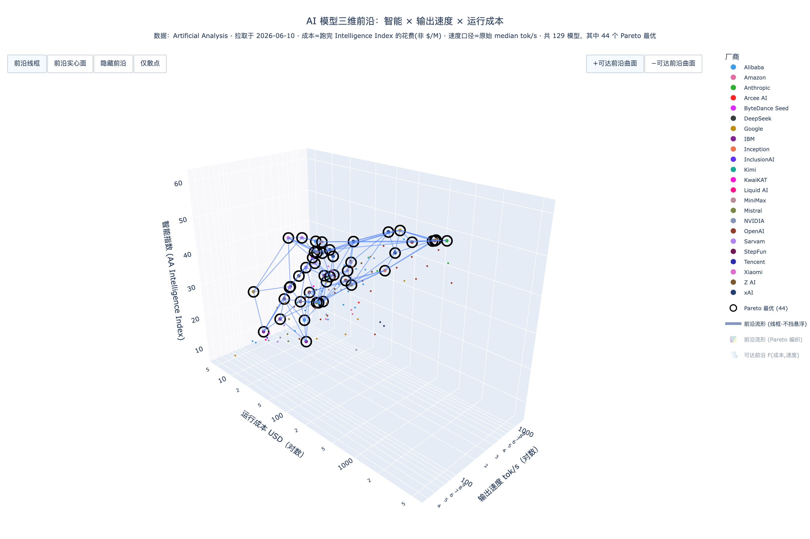

# AA 三维前沿：智能 × 速度 × 运行成本

Artificial Analysis（AA）官网的模型对比图基本都是二维，唯独缺一张**三维**图——
把 **智能、速度、运行成本** 三个维度放在一起看，并找出**最优前沿流形**：
在每个（成本, 速度）组合下，由“最智能模型”编织出的那张曲面（3D Pareto 前沿）。

本项目把这张图做出来，产出一个**可旋转的自包含交互式 HTML**。



## 三个维度与数据口径

| 维度 | 字段 | 来源 |
|---|---|---|
| **智能** | `evaluations.artificial_analysis_intelligence_index` | AA API |
| **速度** | `median_output_tokens_per_second`（输出 tokens/s） | AA API |
| **成本** | `intelligence_index_cost.total_cost` —— **跑完整套 Intelligence Index 的美元花费** | AA 网页 payload |

> 关键：第三维是 **“Cost to Run Artificial Analysis Intelligence Index”**（跑完评测的总花费，
> 例如 Gemini 3 Pro Preview (high) ≈ **\$819.84**），**不是**每百万 token 的混合价（\$/M）。
> 这个数字 **API 不暴露**，只能从 `https://artificialanalysis.ai/models` 页面内嵌的
> Next.js RSC JSON 里解析。两源按模型 UUID（API `id` == 网页 `model_id`）精确合并，
> 用锚点（gpt-oss-20B low≈\$7.68、Gemini 3 Pro high≈\$819.84）断言配对正确。

非正的成本/速度（如无托管定价的开源权重模型，AA 占位为 0）既非真“免费”、也无法在对数轴表示，
一律视为缺失、排除出三维前沿。

## 方法学：最优前沿与剪枝

- **方向约定（更优）**：智能 ↑、运行成本 ↓、速度 ↑。
- **3D Pareto 支配**：`A 支配 B` ⟺ 三维均不劣且至少一维严格优。
- **Pareto 分层（skyline peeling）**：第 1 层 = 非支配集（**最优前沿**），剥离后重复；
  层号即“离前沿的距离”。
- **前沿流形**：把第 1 层（Pareto 最优）的点投影到 (log成本, 速度) 平面做 **Delaunay 三角化**、
  抬升 z=智能，织成半透明曲面 —— 即“在每个成本/速度处由最智能模型编织的流形”。
- **可达前沿曲面（可选副视图）**：`F(成本预算 c, 速度下限 s) = max{智能 | cost≤c 且 speed≥s}`，
  单调阶梯面，图例里可开。
- **剪枝（均衡档，默认）**：剔除**过旧**与**离前沿太远**的模型：
  `保留 = Pareto最优点 ∪ (近 since-months 月 ∧ 处于前 layers 层)`，
  再减去早于 `hard-age-cutoff-months` 的“远古”模型（即便 Pareto 最优）。
  所有阈值均可调（见下）。

## 用法

```bash
# 1) 安装依赖（建议虚拟环境）
python3 -m venv .venv && .venv/bin/pip install -r requirements.txt

# 2) 配置 API key（任选其一）
export ARTIFICIAL_ANALYSIS_API_KEY="aa_xxx"   # 设备级（已写入 ~/.zshenv / ~/.zshrc）
# 或：cp .env.example .env 后填入

# 3) 生成交互式 HTML（默认均衡剪枝）
.venv/bin/python -m src.cli
# → output/frontier_3d.html  （浏览器双击打开即可旋转/缩放）
```

### 参数

| 参数 | 默认 | 含义 |
|---|---|---|
| `--since-months` | 18 | 软窗：近 N 月内算“近期” |
| `--layers` | 3 | 保留前 N 层 Pareto（离前沿距离） |
| `--hard-age-cutoff-months` | 36 | 早于此一律剔除（含 Pareto） |
| `--speed-scale` | `log` | 速度轴 `log` 或 `linear` |
| `--refresh` | 关 | 忽略 `data/raw/` 缓存，重新拉取 |
| `--export` | 无 | 另存静态图 `png` / `svg`（需 kaleido） |
| `--out` | `output/frontier_3d.html` | 输出路径 |

```bash
# 更激进/更聚焦前沿
.venv/bin/python -m src.cli --since-months 12 --layers 2
# 重新拉取最新数据 + 导出静态图
.venv/bin/python -m src.cli --refresh --export png
```

## 交互

- 拖拽旋转、滚轮缩放；悬浮看 名称/厂商/发布日期/智能/速度/运行成本/混合价/Pareto 层。
- 右侧图例按**厂商**着色，可点选过滤；**Pareto 最优** 点用黑色空心圈强调。
- 顶部按钮：`散点+前沿流形` / `加可达前沿曲面` / `仅散点`。

## 结构

```
src/fetch_data.py   # 拉 API + 解析网页成本，按 model_id 合并，锚点校验 → data/processed/models.csv
src/frontier.py     # 3D Pareto 分层、可达前沿曲面、均衡剪枝
src/visualize.py    # Plotly Scatter3d + Delaunay Mesh3d 前沿 + 交互控件
src/cli.py          # 串联：取数 → 剪枝 → 出图
```

## 说明

- 智能分一律取自 API（口径自洽）；成本取自网页。图上标题标注数据拉取日期。
- AA API 免费、限 1000 次/天；`data/raw/` 会缓存原始 API JSON 与网页，默认复用、`--refresh` 重拉。
- `.env` 含真实密钥、已被 `.gitignore` 排除，请勿提交；如密钥外泄可在 AA 平台轮换。
