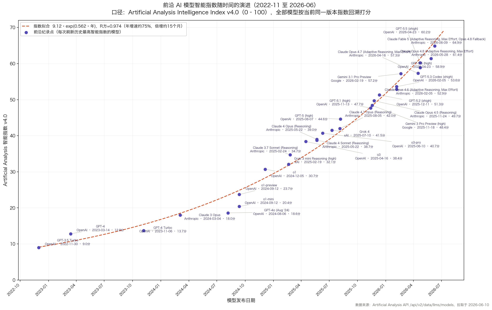
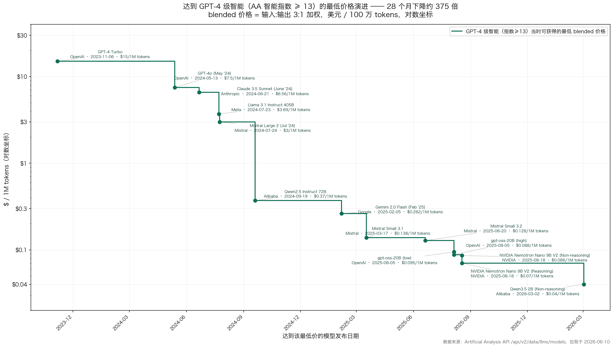

# AI 智能增长趋势与经济影响分析

> 基于 Artificial Analysis 官方 API（`/api/v2/data/llms/models`）实测数据与其官方趋势出版物
> 数据拉取日期：2026-06-10 ｜ 样本：536 个模型，其中 526 个同时具备发布日期与智能指数
> 智能口径：Artificial Analysis Intelligence Index v4.0（下称 AAII，0–100 分，由 GDPval-AA、τ²-Bench Telecom、Terminal-Bench Hard、SciCode、AA-LCR、AA-Omniscience、IFBench、HLE、GPQA Diamond、CritPt 共 10 项评测等权合成）

---

## 一、AI 智能随时间的增长：前沿推进时间线

API 返回的所有模型均按**当前同一版本（v4.0）指数**回溯打分，因此跨时间比较使用的是同一把尺子，不存在"老模型用老版本指数"的口径漂移问题。



*图 1：智能前沿的全部 29 个纪录刷新点（紫色），每点标注「模型名 / 厂商 · 发布日期 · 指数分值」；红色虚线为指数拟合曲线 9.12·exp(0.562·年)。*

按发布日期取累计最大值（即"智能前沿"），关键纪录刷新点：

| 日期 | AAII | 模型 | 厂商 |
|---|---|---|---|
| 2022-11-30 | 9.0 | GPT-3.5 Turbo | OpenAI |
| 2023-03-14 | 12.8 | GPT-4 | OpenAI |
| 2024-03-04 | 18.0 | Claude 3 Opus | Anthropic |
| 2024-09-12 | 23.7 | o1-preview（推理范式开端） | OpenAI |
| 2024-12-05 | 30.7 | o1 | OpenAI |
| 2025-04-16 | 38.4 | o3 | OpenAI |
| 2025-08-07 | 44.6 | GPT-5 (high) | OpenAI |
| 2025-11-24 | 49.7 | Claude Opus 4.5 (Reasoning) | Anthropic |
| 2026-02-19 | 57.2 | Gemini 3.1 Pro Preview | Google |
| 2026-04-23 | 60.2 | GPT-5.5 (xhigh) | OpenAI |
| 2026-06-09 | 64.9 | Claude Fable 5 (Adaptive Reasoning, Max Effort) | Anthropic |

半年快照（前沿值）：

```
2023-01:  9.0   2023-07: 12.8   2024-01: 13.7   2024-07: 18.0
2025-01: 30.7   2025-07: 40.7   2026-01: 51.3   2026-06: 64.9
```

**逐年绝对增量在加大**：2023 年 +4.7 分 → 2024 年 +17.0 分 → 2025 年 +20.6 分 → 2026 年前 5 个月已 +13.6 分。增长不仅没有放缓，反而在加速——这与 Artificial Analysis 在《State of AI: 2025 年终版》开篇信中的判断一致："AI 进展放缓的传言被严重夸大了……到 2026 年初，连写这样一封信的想法都显得荒谬。"

结构性转折点清晰可见：**2024 年 9 月 o1-preview 开启的推理（reasoning）范式**。2023 年全年前沿只涨了约 5 分，推理模型出现后的 2024H2–2025 每半年涨 10 分左右。

## 二、增长是否"近似指数"？

对 29 个前沿点（2022-11 至 2026-06，跨度 3.52 年）分别做线性与指数拟合：

| 模型 | 拟合式 | R² |
|---|---|---|
| 线性 | AAII = −1.06 + 16.86 × 年 | 0.930 |
| **指数** | **AAII = 9.12 × e^(0.562×年)** | **0.974** |

**结论：在该指数的量纲上，指数拟合显著优于线性拟合，年复合增速约 75%，前沿智能分数的倍增周期约 15 个月**——可视为 AI 智能版的"摩尔定律"。

三点重要限定：

1. **量表有界**：AAII 上限 100 分，分数本身不可能永远指数增长，接近上限时必然出现数学意义上的饱和（届时 Artificial Analysis 通常通过升级指数版本、换更难的题来"扩尺"，v1→v4 的演进正是如此）。因此严谨表述是：**在当前量表的可观测区间内，增长轨迹近似指数且尚无减速迹象**。
2. **每一分的含金量在变重**：v4.0 中靠后的分数对应 GDPval-AA（真实职业任务）、Terminal-Bench Hard（长程智能体任务）等远比早期 MMLU 式选择题难的评测，所以"从 50 到 65"代表的真实能力跃迁大于"从 10 到 25"。这意味着线性量表上的近指数增长，对底层能力而言可能是低估。
3. **真正干净的指数曲线在成本侧**。同等智能水平的价格呈数量级式坍塌（API 实测，blended $/1M tokens 最低价）：



*图 2：达到 GPT-4 级智能（AAII ≥ 13）的最低价格演进（对数坐标），全部 14 个降价节点均标注「模型名 / 厂商 · 发布日期 · $/1M tokens」——从 2023-11 GPT-4 Turbo 的 $15 到 2026-03 Qwen3.5 2B 的 $0.04，约 375 倍。*

| 智能档位 | 起点 | 现价 | 降幅 |
|---|---|---|---|
| AAII ≥ 13（GPT-4 级） | $15.00（2023-11，GPT-4 Turbo） | $0.04（2026-03，Qwen3.5 2B） | **约 375×** |
| AAII ≥ 30（o1 级） | $26.25（2024-12，o1） | $0.11（2026-03） | 约 233× |
| AAII ≥ 40 | $35.00（2025-06，o3-pro） | $0.15（2025-12） | 约 233×，仅用 6 个月 |
| AAII ≥ 50 | $4.81（2025-12，GPT-5.2） | $0.53（2026-06，MiniMax-M3） | 约 9×，仅用 6 个月 |

官方报告口径与此吻合：**"GPT-4 级智能现在比原版 GPT-4 便宜 100 倍"，"o1 级智能的单 token 价格下降了 128 倍"**。同等智能的成本年降幅约 90% 以上（每年约一个数量级），这是比智能分数更标准的指数过程。

> 综合判断：**"智能 × 单位智能成本"这一组合维度上，AI 的性价比改善是明确的超指数过程**——分数近指数上升的同时，价格指数下降，两者相乘。

## 三、对各行业与宏观经济的影响

### 1. 来自 Artificial Analysis 自身数据与出版物的证据

- **智能指数本身已经"经济化"**：v4.0 权重最高的单项 GDPval-AA 直接评测"对 GDP 有贡献的关键行业中 44 种职业的真实经济任务"（带网页搜索、代码执行、文件处理等工具）。前沿模型在该项上的持续爬升，等于直接度量"AI 可完成的真实白领工作份额"在扩大。
- **软件业被率先重塑**：年终报告原文——"2025 年初 coding agents 还不存在；到年底，软件工程这一职业已被永久改变——从把代码复制进 ChatGPT，变成指挥可自主工作数分钟的智能体。" 报告判断 2026 年智能体将从编码扩展到更广泛的企业工作负载（"agents for everything"）。
- **算力资本开支**：官方 Trends 页持续追踪微软、谷歌、Meta、亚马逊、甲骨文的季度 Capex（数千亿美元量级），并指出 Capex 是公司 AI 投入决心的最强指标——AI 已成为美股大型科技公司资本配置的第一驱动力。
- **效率与需求的赛跑**：报告给出成本结构分解——小模型与稀疏化约 1/10 算力、软件优化约 1/3、硬件换代约 1/3；但更大模型（~5× 算力/查询）、推理模型（~10× token/查询）、智能体（~20× 请求/任务）使总算力需求不降反升。**单位智能便宜了两个数量级，总开支却在涨**——这是典型的杰文斯悖论，解释了 Capex 与推理需求同步暴涨。
- **生成媒体调查（2025）**：65% 的组织在 12 个月内收回 AI 投资；图像生成个人采用率达 89%。
- **产业格局**：前沿竞争从 OpenAI 一家领跑变为 OpenAI/Anthropic/Google/xAI + 中国实验室（DeepSeek、Qwen、Kimi、MiniMax 等）多极争夺；开源-闭源差距收窄后保持稳定；中国模型在"同等智能最低价"榜单中占据多数席位，是成本坍塌的主要推手之一。

### 2. 外部宏观佐证（非 Artificial Analysis 数据，交叉验证用）

- 德勤《State of AI in the Enterprise 2026》：66% 的组织已从 AI 获得生产率/效率提升；34% 开始用 AI 深度重塑产品、流程或商业模式；但营收增长多数仍是期望（74% 期望 vs 20% 已实现）。
- 麦肯锡《State of AI 2025》：约九成受访组织在常态化使用 AI；23% 已在规模化部署智能体系统，另有 39% 在试验。
- OpenAI 企业报告（2025）：75% 的员工称 AI 改善了产出速度或质量；科技、医疗、制造增速最快，专业服务、金融、科技用量最大。
- 美联储（2026-04）已建立 AI 采用度的常态化监测框架，将其视为影响生产率与劳动力市场的宏观变量。

### 3. 综合判断

成本每年下降约一个数量级 + 智能持续逼近真实职业任务水平，意味着 AI 正在经历"实验室能力 → 经济基础设施"的转换：2023–2024 影响集中在内容生成与客服等浅层应用；2025 起通过编码智能体深度改造软件业；2026 的边际故事是智能体向法律、金融分析、电信运维（τ²-Bench Telecom 入选指数即是信号）等更广泛知识工作扩散。宏观上已确凿的是资本开支渠道（数据中心、芯片、电力投资直接拉动 GDP）；生产率渠道在企业调查中信号明确（效率提升普遍）但尚未充分体现为营收/全要素生产率的统计跃升——与历次通用技术（电力、IT）的扩散滞后规律一致。

## 四、Artificial Analysis 官方趋势分析出版物（题主问的"官网趋势博客"）

官方确实有专门的趋势分析板块和定期报告：

| 资源 | 内容 | 链接 |
|---|---|---|
| AI Insights & Trends（常设趋势页） | 前沿智能随时间演进、分国家对比、同等智能价格趋势、输出速度、大厂 Capex、开源 vs 闭源、MoE 架构、上下文窗口等图表分析 | https://artificialanalysis.ai/trends |
| 季度 State of AI 报告 | Q2/Q3 2025 等，亮点版免费、完整版订阅 | https://artificialanalysis.ai/downloads/state-of-ai/2025/Q3-2025-Artificial-Analysis-State-of-AI-Highlights-Report.pdf |
| State of AI: 2025 年终版 | 本文大量引用，含五大趋势、智能-成本帕累托前沿、价格下降 128× 等 | https://artificialanalysis.ai/downloads/state-of-ai/2025/2025-Year-End-Artificial-Analysis-State-of-AI-Highlights-Report.pdf |
| AI Review 2024 | 2024 年度回顾 | https://artificialanalysis.ai/downloads/ai-review/2024/Artificial-Analysis-AI-Review-2024-Highlights.pdf |
| 智能指数方法论 | v4.0 构成、GDPval-AA 细节、版本沿革 | https://artificialanalysis.ai/methodology/intelligence-benchmarking |
| 智能指数专页 | 实时榜单与历史曲线 | https://artificialanalysis.ai/evaluations/artificial-analysis-intelligence-index |
| 生成媒体调查 2025 | 采用率与 ROI 调查 | https://artificialanalysis.ai/media/survey-2025 |
| 文章（Articles） | 如 Openness Index、AA-LCR 发布文 | https://artificialanalysis.ai/articles/announcing-artificial-analysis-openness-index |

## 五、局限与口径说明

1. AAII 衡量的是基准测试合成分，与"通用智能"不可画等号；评测污染、针对性优化会带来一定虚高。
2. 指数版本随时间升级（v1→v4），官方明确提示大版本间的历史直接对比受限；本文使用 API 当前 v4 口径统一回溯打分，已规避该问题，但代价是早期模型在新难题上的分数被压得很低（GPT-3.5 仅 9 分）。
3. 价格分析使用 blended（3:1 输入/输出）口径的同档最低价，代表"可获得的最便宜同等智能"，不代表主流采购均价。
4. 经济影响部分的企业调查均为自报口径，存在幸存者与乐观偏差；宏观生产率效应的统计确认仍需时间。

---

**附件数据**（均由 2026-06-10 拉取的 API 原始数据生成）：

- [526 个模型的发布日期、AAII v4 分数与 blended 价格](source-data-snapshots/artificial-analysis-api-language-model-intelligence-and-blended-price-2026-06-10.csv)
- [29 个智能前沿纪录点](source-data-snapshots/artificial-analysis-intelligence-frontier-records-2026-06-10.csv)
